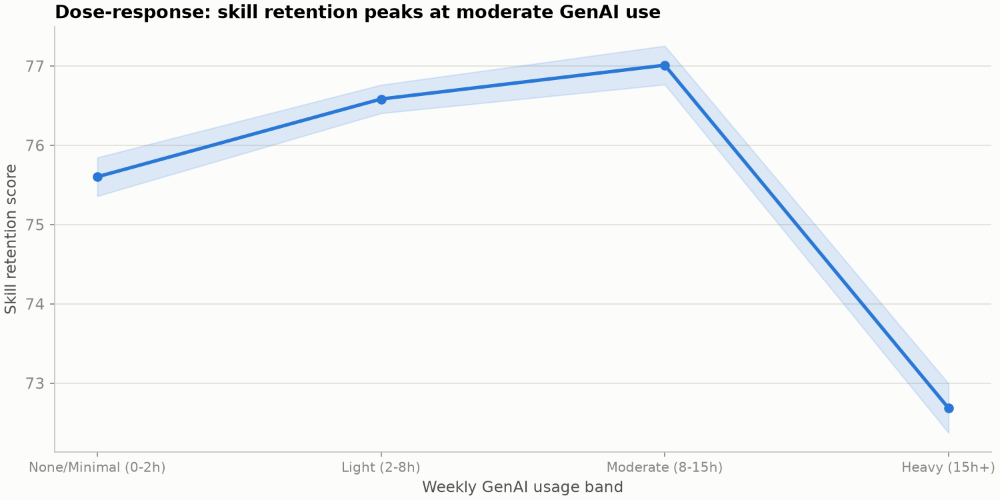
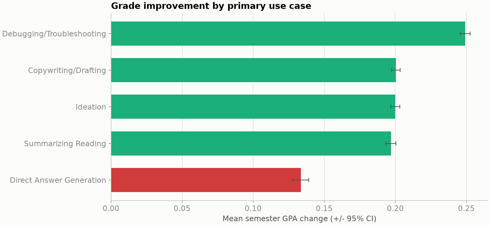
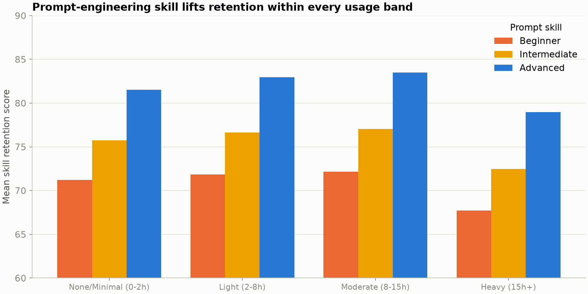
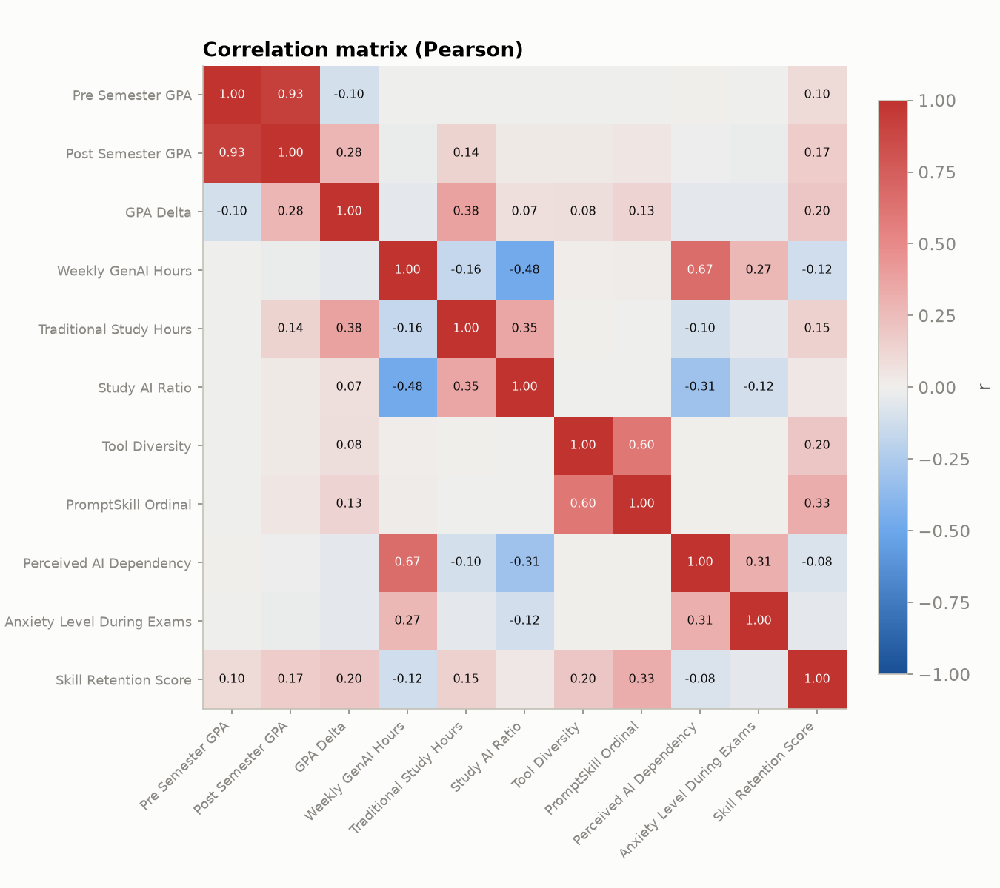

# The Mode-of-Engagement Hypothesis: How Generative-AI Usage Patterns Shape Student Learning Outcomes

## Abstract

Generative artificial intelligence (GenAI) has become a routine part of student
work within a single academic cycle, yet public debate remains anchored to a
crude question: *how much* students use it. This study argues that intensity of
use is the wrong variable. Using a cross-sectional dataset of 50,000 students
spanning five academic disciplines, we test the **mode-of-engagement
hypothesis**: that academic outcomes are governed by *how* GenAI is used — the
task it is applied to, the skill with which it is prompted, and the degree of
dependency it creates — rather than by weekly hours alone. We combine
descriptive analysis, formal statistical inference, and supervised machine
learning to characterise three outcomes: change in grade-point average across a
semester (`GPA_Delta`), a `Skill_Retention_Score`, and categorical
`Burnout_Risk_Level`. The evidence supports a consistent story. The relationship
between usage intensity and skill retention is non-monotonic (an inverted-U with
a moderate-use optimum); the *purpose* of use separates outcomes more sharply
than the *amount*, with cognitive-offloading patterns (direct answer generation)
underperforming analytic patterns (debugging, ideation); prompt-engineering
skill is a leading correlate of skill retention; and traditional study time
remains the single strongest predictor of grade improvement. GenAI, on this
evidence, complements deliberate study rather than substituting for it. These
findings have direct implications for institutional AI policy and for the case
for structured AI-literacy instruction.

## Societal relevance

Universities are currently choosing between three postures toward GenAI:
prohibition, permissive tolerance, and active integration. That choice is being
made with little quantitative guidance. If outcomes were driven by usage volume,
restriction would be the rational policy. If instead they are driven by *mode of
engagement*, the rational policy is the opposite of restriction: teach students
to use these tools analytically and to prompt them well. This project provides
evidence bearing directly on that decision and frames AI literacy as an
educational-equity issue rather than a compliance problem.

## Research questions

- **RQ1 (Intensity).** Is the association between weekly GenAI hours and skill
  retention monotonic, or does an optimum exist?
- **RQ2 (Purpose).** Do primary use cases differ systematically in their
  association with grade improvement and skill retention, holding intensity
  roughly constant?
- **RQ3 (Competence).** Does prompt-engineering skill predict skill retention
  independently of how much a student uses GenAI?
- **RQ4 (Substitution).** Does GenAI use substitute for, or complement,
  traditional study time in predicting grade improvement?
- **RQ5 (Wellbeing).** Which factors drive burnout risk, and is perceived AI
  dependency among them?
- **RQ6 (Prediction).** Can student outcomes be predicted from behavioural and
  contextual features, and which features carry the predictive signal?

## Dataset

| Property | Value |
|---|---|
| Records | 50,000 students |
| Features | 16 (raw) |
| Missing values | None |
| Unit of observation | One student, one semester |
| Source file | `data/ai_student_impact_dataset (1).csv` |

### Variable dictionary

| Column | Type | Description |
|---|---|---|
| `Student_ID` | int | Unique identifier (dropped from analysis) |
| `Major_Category` | categorical | STEM, Business, Humanities, Medical, Arts |
| `Year_of_Study` | ordinal | Freshman → Graduate |
| `Pre_Semester_GPA` | float | GPA at the start of the semester (0-4) |
| `Weekly_GenAI_Hours` | float | Self-reported weekly hours of GenAI use |
| `Primary_Use_Case` | categorical | Dominant task the student uses GenAI for |
| `Prompt_Engineering_Skill` | ordinal | Beginner / Intermediate / Advanced |
| `Tool_Diversity` | int | Number of distinct GenAI tools used (1-5) |
| `Paid_Subscription` | bool | Whether the student pays for a GenAI tool |
| `Traditional_Study_Hours` | float | Weekly hours of non-AI study |
| `Perceived_AI_Dependency` | int | Self-rated dependency (1-10) |
| `Institutional_Policy` | categorical | Ban / allowed-with-citation / encouraged |
| `Anxiety_Level_During_Exams` | int | Self-rated exam anxiety (1-10) |
| `Post_Semester_GPA` | float | GPA at the end of the semester (0-4) |
| `Skill_Retention_Score` | float | Assessed retention of core skills (0-100) |
| `Burnout_Risk_Level` | categorical | Low / Medium / High |

### Engineered features

Constructed in Notebook 01 and reused downstream:

- `GPA_Delta = Post_Semester_GPA - Pre_Semester_GPA` — the primary continuous
  outcome (semester grade improvement).
- `GenAI_Intensity_Band` — binned weekly hours (None/Light/Moderate/Heavy) for
  dose-response analysis.
- `Study_AI_Ratio` — traditional study hours relative to GenAI hours, a proxy
  for whether AI complements or replaces study.
- `Offloading_Use` — binary flag for cognitive-offloading use cases
  (direct answer generation) versus analytic/generative use.

## Repository structure

```
.
├── data/
│   ├── ai_student_impact_dataset (1).csv   # raw, immutable input
│   └── processed/                          # cleaned, feature-engineered outputs
├── notebooks/
│   ├── 01_data_understanding_and_quality.ipynb
│   ├── 02_exploratory_data_analysis.ipynb
│   ├── 03_statistical_inference.ipynb
│   └── 04_predictive_modeling.ipynb
├── reports/
│   └── figures/                            # exported publication figures
├── requirements.txt
├── README.md
└── CLAUDE.md
```

## Analytical workflow

1. **Notebook 01 — Data understanding and quality.** Profiling, integrity and
   plausibility checks, outlier characterisation, feature engineering, and
   persistence of a clean analysis table to `data/processed/`.
2. **Notebook 02 — Exploratory data analysis.** Univariate distributions,
   bivariate relationships, the dose-response curve, use-case comparisons, and a
   correlation structure — rendered with a single, colour-vision-safe visual
   system.
3. **Notebook 03 — Statistical inference.** Formal tests behind the claims:
   correlation with confidence intervals, one-way ANOVA and post-hoc contrasts
   across use cases, a quadratic term test for the inverted-U, and a
   multiple-regression model (OLS) that isolates each factor's contribution.
4. **Notebook 04 — Predictive modelling.** Supervised learning for two tasks —
   classifying burnout risk and regressing skill retention — with a
   leakage-aware pipeline, model comparison against baselines, honest
   held-out evaluation, and permutation-importance explanations.

## Reproducibility

```bash
python -m venv .venv
source .venv/bin/activate
pip install -r requirements.txt
jupyter lab            # run notebooks 01 → 04 in order
```

All stochastic steps use a fixed seed (`RANDOM_STATE = 42`). Notebook 01 must be
run first, as it produces the processed table consumed by 02-04. Package
versions are pinned in `requirements.txt` against the tested environment
(Python 3.14).

## Key findings

Across descriptive, inferential, and predictive analyses the data support the
mode-of-engagement hypothesis: *how* GenAI is used explains student outcomes
better than *how much* it is used, and traditional study time remains the
dominant lever on grade improvement. The four figures below summarise the
load-bearing results; each is reproduced from the notebooks and stored in
`reports/figures/`.

### Finding 1 - The intensity-retention relationship is non-monotonic



**Figure 1.** Mean skill-retention score across ordered weekly-usage bands, with
95% confidence intervals. Retention rises from minimal (75.6) through light
(76.6) to a peak at moderate use (77.0, 8-15 h/week) and then falls sharply for
heavy users (72.7). A quadratic regression confirms the curvature (negative
squared term, *p* < 1e-150; estimated optimum near 9 weekly hours). Usage
intensity therefore has an optimum rather than a monotonic effect.

### Finding 2 - Purpose separates outcomes more than volume



**Figure 2.** Mean within-student GPA change by primary use case (95% CI). The
cognitive-offloading pattern - direct answer generation (red) - is associated
with the smallest grade improvement (+0.133), while analytic and generative uses
such as debugging (+0.249) rank highest. One-way ANOVA rejects equality of means
(*p* < 1e-16); the offloading-versus-analytic contrast has Cohen's *d* = -0.43.

### Finding 3 - Prompt-engineering skill lifts retention within every usage band



**Figure 3.** Mean skill retention by usage band and prompt-engineering skill.
Within every intensity band, advanced prompt users retain more skill than
beginners, and the advantage widens under heavy use - competence with the tool,
not abstinence from it, protects the heavy-use group. The effect survives
controlling for usage volume in a multiple regression (Notebook 03).

### Finding 4 - Correlation structure of the study variables



**Figure 4.** Pearson correlation matrix (blue-to-red diverging scale about a
neutral zero). Grade improvement (`GPA_Delta`) is most strongly associated with
traditional study hours; skill retention correlates positively with prompt skill
and tool diversity and negatively with weekly GenAI hours and perceived
dependency - the inverted-U and offloading stories visible in a single map. A
standardised multiple regression (Notebook 03) confirms that study time is the
dominant lever, with GenAI usage patterns acting at the margin.

A full narrative synthesis is written at the end of Notebook 04.

## Limitations

The dataset is cross-sectional and largely self-reported; associations reported
here are not causal claims. Pre- and post-semester GPA permit a within-student
change measure, which strengthens the design, but unobserved confounding (for
example, baseline conscientiousness) cannot be excluded. Findings should be read
as hypotheses about mechanism that motivate controlled follow-up, not as
settled effects.

## License and attribution

Analysis code in this repository is available for reuse under the terms the
repository owner elects. The dataset retains the license of its original source.
